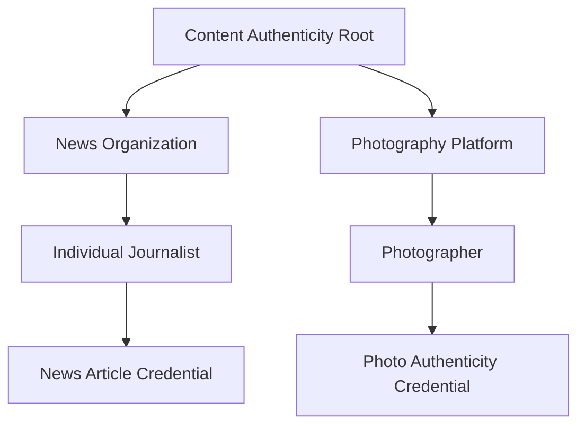
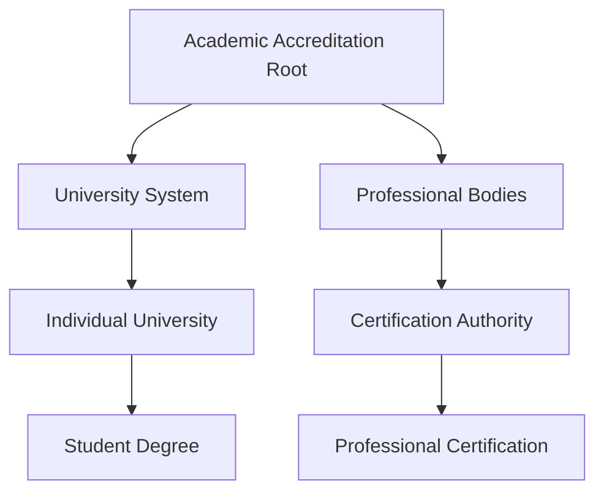
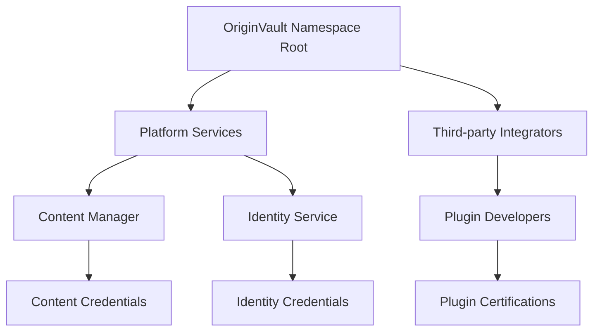

# Multi-Root Trust Architecture

## Overview

The OriginVault schema registry supports a **multi-root trust architecture** where any entity can establish itself as a root authority for specific domains, namespaces, or concepts. This decentralized approach enables flexible trust chains that can serve various purposes while maintaining interoperability with established standards.

## Core Principles

### 1. **Decentralized Root Authority**
- Any entity can declare itself as a root authority
- No single global root - multiple specialized roots coexist
- Each root serves specific domains or purposes

### 2. **Namespace-Based Trust**
- Roots can establish authority over specific namespaces
- Clear scope definition prevents conflicts
- Cross-namespace interoperability supported

### 3. **Flexible Trust Delegation**
- Roots can delegate authority to trusted issuers
- Multi-level delegation chains supported
- Configurable delegation policies and constraints

### 4. **Standards Interoperability**
- Compatible with W3C Verifiable Credentials
- Integrates with schema.org vocabulary
- Follows cheqd DTC patterns
- Supports DIF foundation schemas

## Root Authority Types

### Namespace Roots
Establish trust for specific domains or namespaces:
```json
{
  "rootType": "namespace",
  "scope": "content-authenticity.org",
  "trustChainPurpose": "Verify content authenticity and provenance"
}
```

### Platform Roots
Govern platform-specific operations:
```json
{
  "rootType": "platform", 
  "scope": "social-media-platform",
  "trustChainPurpose": "User verification and content moderation"
}
```

### User Roots
Individual users establishing personal trust:
```json
{
  "rootType": "user",
  "scope": "personal-content-creation",
  "trustChainPurpose": "Authenticate personal content and identity"
}
```

### Organization Roots
Corporate or institutional trust:
```json
{
  "rootType": "organization",
  "scope": "academic-institution.edu",
  "trustChainPurpose": "Certify academic credentials and achievements"
}
```

### Community Roots
Community-governed trust:
```json
{
  "rootType": "community",
  "scope": "open-source-software",
  "trustChainPurpose": "Verify software integrity and contributor identity"
}
```

### Concept Roots
Abstract concept or standard-based trust:
```json
{
  "rootType": "concept",
  "scope": "supply-chain-transparency", 
  "trustChainPurpose": "Track product provenance and ethical sourcing"
}
```

## Trust Chain Examples

### Example 1: Content Authenticity Chain



**Root Authority Declaration:**
```json
{
  "@context": ["https://www.w3.org/2018/credentials/v1", "https://schemas.originvault.box/contexts/trust-chain-core.jsonld"],
  "type": ["VerifiableCredential", "RootAuthorityDeclaration"],
  "issuer": {"id": "did:cheqd:mainnet:content-auth-org"},
  "issuanceDate": "2024-01-01T00:00:00Z",
  "credentialSubject": {
    "id": "did:cheqd:mainnet:content-auth-org",
    "rootType": "concept",
    "scope": "content-authenticity",
    "trustChainPurpose": "Verify content authenticity and combat misinformation",
    "governanceModel": {
      "type": "consortium",
      "participants": ["did:web:journalism-council.org", "did:web:photo-association.org"]
    }
  }
}
```

### Example 2: Academic Credentials Chain



### Example 3: OriginVault Namespace Chain



## Delegation Patterns

### Direct Delegation
Root directly delegates to trusted issuer:
```json
{
  "delegationType": "trusted-issuer",
  "trustChainContext": {
    "rootAuthority": "did:cheqd:mainnet:root-authority",
    "parentAuthority": "did:cheqd:mainnet:root-authority", 
    "chainDepth": 1
  }
}
```

### Hierarchical Delegation
Multi-level delegation through intermediaries:
```json
{
  "delegationType": "sub-root",
  "trustChainContext": {
    "rootAuthority": "did:cheqd:mainnet:root-authority",
    "parentAuthority": "did:cheqd:mainnet:regional-authority",
    "chainDepth": 2
  }
}
```

## Interoperability Mechanisms

### Cross-Root Recognition
Roots can recognize and validate credentials from other roots:
```json
{
  "interoperability": {
    "recognizedRoots": [
      "did:cheqd:mainnet:other-content-root",
      "did:web:global-journalism-council.org"
    ],
    "crossChainValidation": true,
    "federationMember": "global-content-authenticity-federation"
  }
}
```

### Federation Support
Multiple roots can join federations for broader interoperability:
- Shared trust policies
- Cross-validation protocols
- Common governance frameworks

## Governance Models

### Self-Governed
Single entity makes all decisions:
```json
{
  "governanceModel": {
    "type": "self-governed",
    "policyDocument": "https://example.com/governance-policy"
  }
}
```

### DAO Governance
Decentralized autonomous organization:
```json
{
  "governanceModel": {
    "type": "dao",
    "participants": ["did:dao:governance-token-holders"],
    "policyDocument": "https://governance.dao/policies"
  }
}
```

### Committee Governance
Multi-stakeholder committee:
```json
{
  "governanceModel": {
    "type": "committee", 
    "participants": [
      "did:web:stakeholder1.org",
      "did:web:stakeholder2.org",
      "did:web:stakeholder3.org"
    ],
    "policyDocument": "https://committee.org/governance"
  }
}
```

## Implementation Guidelines

### For Root Authorities

1. **Define Clear Scope**: Specify exactly what domain or concept your root governs
2. **Establish Governance**: Choose appropriate governance model for your use case
3. **Set Delegation Policies**: Define how and to whom you'll delegate authority
4. **Plan Interoperability**: Consider which other roots you want to recognize
5. **Implement Revocation**: Establish clear revocation criteria and processes

### For Trusted Issuers

1. **Verify Chain of Trust**: Ensure your accrediting authority is legitimate
2. **Follow Operational Requirements**: Comply with technical and policy standards
3. **Maintain Metrics**: Track trust scores and operational metrics
4. **Report Regularly**: Fulfill reporting obligations to delegating authority
5. **Plan for Revocation**: Understand appeal processes and criteria

### For Verifiers

1. **Validate Full Chain**: Check credentials back to root authority
2. **Check Revocation Status**: Verify credentials haven't been revoked
3. **Respect Scope Limitations**: Only accept credentials within stated scope
4. **Cross-Reference Federations**: Consider federated root recognition
5. **Implement Caching**: Cache trust chain validations for performance

## Security Considerations

### Root Authority Security
- Strong cryptographic keys and secure key management
- Multi-signature governance for high-value roots
- Regular security audits and penetration testing
- Disaster recovery and business continuity planning

### Chain of Trust Validation
- Cryptographic verification at each delegation level
- Real-time revocation checking
- Timestamp validation for credential freshness
- Protection against replay attacks

### Cross-Chain Security
- Secure federation protocols
- Trust boundary enforcement
- Attack vector analysis for cross-root validation
- Incident response coordination

## Migration and Evolution

### Adding New Roots
1. Define scope and purpose
2. Establish governance structure
3. Create root authority declaration
4. Anchor on blockchain
5. Begin delegation process

### Updating Existing Roots
1. Version control for policy changes
2. Backward compatibility considerations
3. Migration paths for existing credentials
4. Stakeholder notification processes

### Retiring Roots
1. Deprecation timeline announcement
2. Credential migration or conversion
3. Final revocation and cleanup
4. Historical record preservation

## Standards Compliance

### W3C Verifiable Credentials
- Full VC data model compliance
- Standard proof formats
- Interoperable with VC ecosystems

### Schema.org Integration
- Schema.org vocabulary mappings
- SEO and discovery benefits
- Broad ecosystem compatibility

### DIF Foundation
- BasicPerson and other foundational schemas
- Identity hub integration
- Decentralized web node compatibility

### cheqd DTC Patterns
- Resource-based credential anchoring
- Payment integration capabilities
- Governance framework alignment

## Conclusion

The multi-root trust architecture enables a flexible, decentralized approach to trust establishment while maintaining interoperability with existing standards. This design allows for:

- **Specialization**: Each root can focus on specific domains
- **Innovation**: New trust models can emerge without global coordination
- **Resilience**: No single point of failure for the entire system
- **Scalability**: Trust chains can grow organically as needed
- **Interoperability**: Standards compliance ensures broad compatibility

By empowering any entity to establish trust roots for their specific needs, this architecture supports the diverse requirements of the modern digital economy while maintaining the security and verifiability that verifiable credentials provide. 