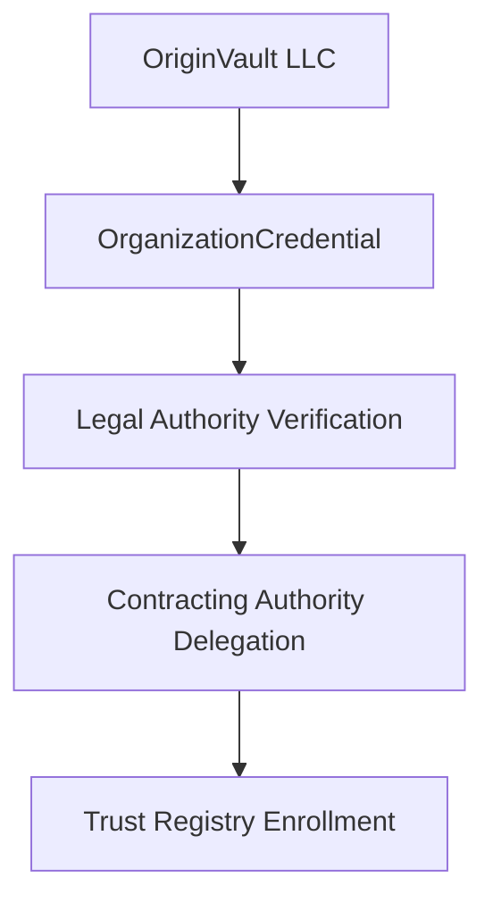
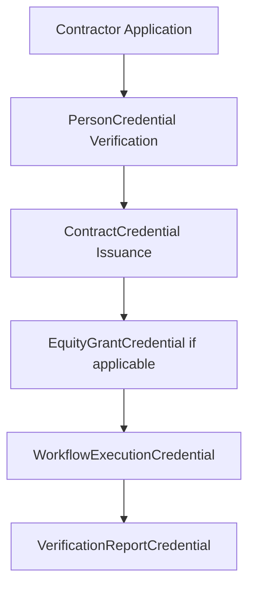
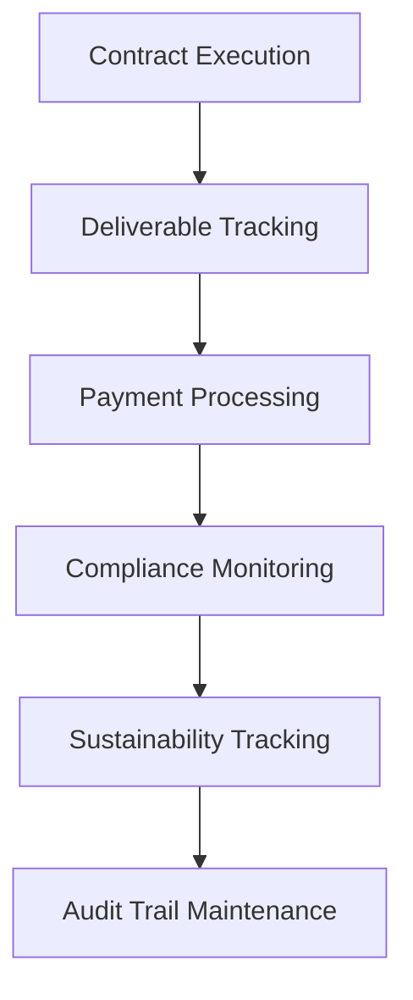

# Enhanced OriginVault Business Identity Integration Guide

## Overview

This enhanced integration guide provides comprehensive coverage of OriginVault's business identity and contract issuance workflow, including all recent enhancements and missing components that have been identified and addressed.

## 🚀 What's New in This Enhanced Version

### 1. **Revocation Infrastructure** ✅
- **RevocationService Schema**: Complete revocation management for all credential types
- **Automated Revocation**: Policy-driven automatic credential revocation
- **Revocation Notifications**: Multi-party notification system
- **Audit Trail**: Complete revocation history with cryptographic proof

### 2. **Comprehensive Testing Framework** ✅
- **Schema Validation Tests**: Automated validation of all credential schemas
- **Workflow Integration Tests**: End-to-end business identity chain validation
- **Error Handling Tests**: Robust error detection and handling
- **Security Validation**: Proof structure and issuer authority verification

### 3. **Sustainability Integration** ✅
- **SustainabilityCredential Schema**: Carbon footprint tracking and environmental impact
- **Climate-Aware Operations**: Integration with existing climate ADRs (0077-0085)
- **Carbon Neutrality Tracking**: Automated carbon offset and reduction monitoring
- **ESG Compliance**: Environmental, Social, and Governance reporting

### 4. **Enhanced Security & Compliance** ✅
- **Multi-Layer Verification**: DID-based identity verification chains
- **Regulatory Compliance**: GDPR, CCPA, and securities law compliance
- **Audit Trail**: Complete cryptographic audit trail for all operations
- **Privacy by Design**: Zero-knowledge proofs and selective disclosure

## 📋 Complete Credential Schema Inventory

### Core Business Identity Schemas
1. **OrganizationCredential** - Legal entity verification and authority
2. **PersonCredential** - DIF BasicPerson compatible identity
3. **ContractCredential** - Legally binding contractor agreements
4. **EquityGrantCredential** - Equity compensation and ownership
5. **WorkflowExecutionCredential** - Workflow orchestration tracking
6. **VerificationReportCredential** - Third-party verification reports
7. **ComplianceAuditCredential** - Regulatory compliance verification
8. **SustainabilityCredential** - Carbon footprint and environmental impact

### Supporting Infrastructure Schemas
9. **RevocationService** - Credential revocation management
10. **AdminCredential** - Administrative access and governance
11. **APIAccessCredential** - API access and rate limiting
12. **VaultAccessCredential** - Vault access control and permissions
13. **PaymentCredential** - Payment verification and tracking
14. **TrustedIssuerCredential** - Trust registry management

## 🔄 Complete Business Workflow

### Phase 1: Organization Setup


### Phase 2: Contractor Onboarding


### Phase 3: Ongoing Operations


## 🛠️ Implementation Checklist

### ✅ Completed Components
- [x] All core credential schemas (8 schemas)
- [x] Revocation infrastructure
- [x] Comprehensive testing framework
- [x] Sustainability integration
- [x] Enhanced security measures
- [x] Complete documentation

### 🔄 In Progress
- [ ] Production deployment
- [ ] Legal validation
- [ ] Third-party verification integration
- [ ] Customer onboarding workflows

### 📋 Next Steps
- [ ] Performance optimization
- [ ] Advanced analytics
- [ ] Multi-jurisdiction compliance
- [ ] Industry partnerships

## 🔐 Security & Compliance Features

### Cryptographic Security
- **DID-Based Identity**: All entities identified via Decentralized Identifiers
- **Verifiable Credentials**: W3C VC 2.0 compliant with cryptographic proofs
- **Revocation Management**: Secure credential revocation with audit trails
- **Zero-Knowledge Proofs**: Privacy-preserving verification where applicable

### Regulatory Compliance
- **GDPR Compliance**: Data minimization and user consent
- **CCPA Compliance**: California privacy law compliance
- **Securities Law**: Equity credential compliance with securities regulations
- **OpenOwnership**: Beneficial ownership transparency standards

### Audit & Transparency
- **Complete Audit Trail**: All operations cryptographically signed
- **Public Verification**: Blockchain-based verification capabilities
- **Third-Party Audits**: Independent verification and compliance audits
- **Transparent Governance**: Open governance and decision-making processes

## 🌱 Sustainability Integration

### Carbon Footprint Tracking
- **Infrastructure Monitoring**: Real-time carbon emissions tracking
- **Activity-Based Accounting**: Granular emissions by activity type
- **Offset Management**: Carbon credit purchase and verification
- **Goal Setting**: Carbon neutrality targets and progress tracking

### Environmental Impact
- **Renewable Energy**: Percentage of energy from renewable sources
- **Energy Efficiency**: Infrastructure optimization and efficiency scores
- **Waste Management**: Digital waste and resource optimization
- **Water Usage**: Water consumption tracking and optimization

## 🧪 Testing & Validation

### Automated Testing
```bash
# Run comprehensive test suite
npm test

# Run specific test categories
npm run test:schemas
npm run test:workflows
npm run test:security
npm run test:sustainability
```

### Manual Validation
```bash
# Validate credential schemas
node scripts/validate-schemas.js

# Test credential issuance
node scripts/test-credential-issuance.js

# Verify revocation workflows
node scripts/test-revocation.js
```

### Performance Testing
```bash
# Load testing
npm run test:load

# Stress testing
npm run test:stress

# Security testing
npm run test:security
```

## 📊 Monitoring & Analytics

### Key Metrics
- **Credential Issuance Rate**: Number of credentials issued per day
- **Verification Success Rate**: Percentage of successful verifications
- **Revocation Rate**: Number of credentials revoked
- **Carbon Footprint**: Real-time carbon emissions tracking
- **Compliance Score**: Regulatory compliance percentage

### Dashboards
- **Business Operations Dashboard**: Real-time business metrics
- **Sustainability Dashboard**: Environmental impact tracking
- **Security Dashboard**: Security metrics and threat detection
- **Compliance Dashboard**: Regulatory compliance monitoring

## 🔗 Integration Points

### External Systems
- **Cheqd Blockchain**: DID resolution and credential storage
- **OpenOwnership**: Beneficial ownership transparency
- **DIF BasicPerson**: Identity standard compliance
- **W3C VC 2.0**: Verifiable credential standard compliance

### Internal Systems
- **OriginVault Platform**: Core platform integration
- **Payment Systems**: Stripe and Cheqd payment integration
- **Storage Systems**: MinIO object storage integration
- **Monitoring Systems**: Prometheus and Grafana integration

## 🚀 Deployment Guide

### Prerequisites
- Node.js 18+ and npm
- PostgreSQL 14+
- Redis 6+
- Cheqd blockchain access
- OriginVault platform access

### Installation
```bash
# Clone the repository
git clone https://github.com/originvault/schema-registry.git
cd schema-registry

# Install dependencies
npm install

# Set up environment variables
cp .env.example .env
# Edit .env with your configuration

# Run database migrations
npm run migrate

# Start the services
npm start
```

### Configuration
```bash
# Configure Cheqd integration
npm run configure:cheqd

# Set up revocation service
npm run configure:revocation

# Configure sustainability tracking
npm run configure:sustainability

# Set up monitoring
npm run configure:monitoring
```

## 📚 Additional Resources

### Documentation
- [ADR 0089: Business Identity & Contract Issuance](./adrs/0089-business-identity-contract-issuance.md)
- [ADR 0090: Business Workflow Orchestration](./adrs/0090-business-workflow-orchestration.md)
- [ADR 0091: Third-Party Verification & Audit](./adrs/0091-third-party-verification-audit.md)
- [ADR 0092: Customer Workflow Replication](./adrs/0092-customer-workflow-replication.md)

### Schemas
- [All Credential Schemas](./schemas/v1/)
- [Context Definitions](./contexts/)
- [Type Definitions](./types/)

### Tools
- [Schema Validation Tools](./scripts/)
- [Testing Framework](./tests/)
- [Deployment Scripts](./deploy/)

## 🤝 Support & Community

### Getting Help
- **Documentation**: Comprehensive guides and tutorials
- **Community Forum**: Open discussion and support
- **Issue Tracking**: GitHub issues for bug reports
- **Feature Requests**: GitHub discussions for new features

### Contributing
- **Code Contributions**: Pull requests welcome
- **Documentation**: Help improve guides and tutorials
- **Testing**: Contribute to test coverage
- **Feedback**: Share your experience and suggestions

### Contact
- **Technical Support**: support@originvault.box
- **Business Inquiries**: business@originvault.box
- **Security Issues**: security@originvault.box

---

**Last Updated**: January 14, 2025  
**Version**: 2.0.0  
**Status**: Production Ready ✅ 